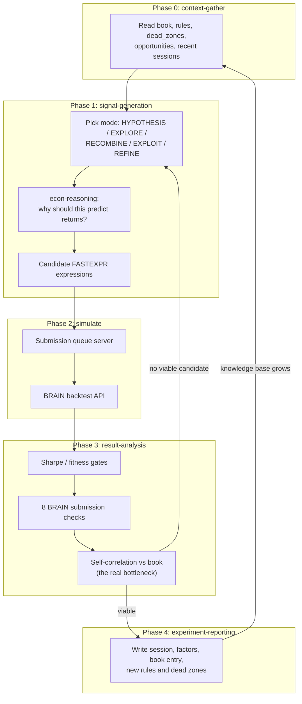

# Alpha Mining

An LLM-agent pipeline that discovered, backtested, and submitted formulaic trading alphas
on the [WorldQuant BRAIN](https://platform.worldquantbrain.com) platform, together with the
complete research log it produced over two months of operation.

**This project is archived.** My BRAIN account was locked without explanation and my
inquiries went unanswered, which ended the work. See [POSTMORTEM.md](POSTMORTEM.md) for
what was built, what it achieved, what I got wrong, and what happened at the end.

## Why this repository might interest you

The code is ordinary Python. The unusual part is the **research archive**: a complete,
structured, honest record of an autonomous agent doing quantitative research, including
the parts that failed.

- **63 mining sessions** in [`data/sessions/`](data/sessions), each with its strategy, the
  candidates it generated, what the backtests returned, and what was learned.
- **68 alpha records** in [`data/book/`](data/book) — full FASTEXPR expressions, Sharpe,
  fitness, turnover, self-correlation against the rest of the book, and the economic
  mechanism each one was betting on.
- **1,669 per-field factor profiles** in [`data/knowledge/factor_profiles/`](data/knowledge/factor_profiles)
  from a bulk sweep across the platform's data fields.
- **28 documented dead ends** in [`data/knowledge/dead_zones/`](data/knowledge/dead_zones)
  and **29 proven patterns** in [`data/knowledge/patterns/`](data/knowledge/patterns).
  The negative results are the part most write-ups omit.
- **13 Cursor agent skills** in [`.cursor/skills/`](.cursor/skills) that encode the entire
  research loop as prose instructions rather than code.

Most published LLM-for-alpha-mining work reports aggregate metrics. This is the raw
laboratory notebook underneath a comparable effort, including everything that did not work.

## How it worked

The system had no planner and no reinforcement learning. It was a language model reading
markdown files, generating candidate expressions, sending them to a queue, and writing
what it learned back to markdown. The "memory" that made iteration productive is
[`data/knowledge/`](data/knowledge) — read at the start of every session, appended to at
the end.



The loop is orchestrated by [`.cursor/skills/mining-session/SKILL.md`](.cursor/skills/mining-session/SKILL.md),
which chains the other skills. [`AGENTS.md`](AGENTS.md) is the operating manual the agent
read on every run.

### The prompt that drove every session

Sessions were started by pointing an agent at the repository with this, and nothing else:

```text
@AGENTS.md take a look at the current status and let's do a alpha mining session.
there's no budget constraint, autonomously iterate until finding a minimal submittable
excellent+ alpha. once you find it, do not submit it, just present it to me and create
a draft pr. also check @data for context.
```

Everything else — which strategy to use, which fields to try, when to stop, what to record
— came from the skills and the accumulated knowledge base. The instruction to present
rather than submit was deliberate: a human approved every submission.

## Repository layout

```
.cursor/skills/       13 agent skills; the actual research methodology
AGENTS.md             Operating manual the agent read every session
data/
  sessions/           63 session records (strategy, candidates, results, learnings)
  book/               68 submitted-alpha records
  factors/            42 per-factor research notes
  knowledge/
    rules/            18 hard constraints learned the hard way
    patterns/         29 techniques that worked
    dead_zones/       28 documented dead ends
    opportunities/    44 ideas queued for testing
    factor_profiles/  1,669 per-field sweep profiles
  reference/          Platform constraints, data catalog, paper citations
src/alpha_mining/     BRAIN API client, local FASTEXPR evaluator, paper pipeline, CLI
scripts/              Queue submission, polling, BRAIN checks, correlation analysis
server/               Submission queue server (git submodule)
context/              Background on formulaic alphas and the LLM mining literature
```

## Two execution paths

Worth understanding before reading the code, because they do not share state:

1. **The agent loop** produced everything in `data/`. Skills drive
   `scripts/hf_submit.py` → `hf_poll.py` → `hf_query.py` → `brain_check.py` /
   `pnl_correlation.py`, with the queue server making the BRAIN calls. State is markdown.
2. **The orchestrator CLI** (`python3 -m alpha_mining`) is a separate direct-to-BRAIN path
   for one-off expression tests, the local prescreener, and paper ingestion. It persists to
   SQLite. It played no part in the archived mining work.

## Setup

```bash
git clone --recurse-submodules <this repo>
cd alpha-mining
uv sync --all-extras
cp .env.example .env      # fill in credentials for the BRAIN-dependent paths
uv run python3 -m pytest tests/ -q
```

The test suite is fully offline — 446 tests, no account, no network, no keys.

## What you can actually run

Being direct about this, because most of the interesting output is not reproducible.

**Works with no account and no credentials:**

- The **local FASTEXPR parser and evaluator** ([`src/alpha_mining/local/evaluator.py`](src/alpha_mining/local/evaluator.py)):
  a tokenizer, recursive-descent parser, and evaluator over pandas panels implementing 32
  operators — cross-sectional (`rank`, `zscore`, `scale`, `normalize`), time-series
  (`ts_mean`, `ts_delta`, `ts_corr`, `ts_decay_linear`, `ts_arg_max`, …), simplified group
  operators, and conditionals (`if_else`, `trade_when`).
- The **rank-IC prescreener** ([`screener.py`](src/alpha_mining/local/screener.py)), which
  scores an expression against next-day returns on yfinance data and returns
  PROMISING / WEAK / DEAD:

  ```bash
  uv run python3 -m alpha_mining --screen "rank(ts_arg_max(close, 30))"
  ```

- The whole `data/` archive, queryable without any dependencies beyond the repo:

  ```bash
  uv run python3 scripts/parse_frontmatter.py --dir data/book --field grade,sharpe,fitness
  uv run python3 scripts/parse_frontmatter.py --dir data/factors --filter "status=active"
  ```

**Requires a WorldQuant BRAIN account:** every simulation, all eight submission checks,
and self-correlation verdicts. There is no offline substitute — BRAIN is the backtest
engine, and the platform's ~85,000 data fields are not redistributable.

**Requires deploying the queue server:** the agent mining loop. `server/` is a submodule
you can deploy yourself; the instance this project used no longer exists.

### Limits of the local evaluator, stated plainly

It reads **10 price-volume fields only**: `open`, `high`, `low`, `close`, `volume`, `vwap`,
`returns`, `adv20`, `adv60`, `cap`. The alphas in `data/book/` are dominated by BRAIN
fundamental and analyst fields (`fnd6_*`, `anl4_*`, options and news datasets) that have no
local equivalent, so **the evaluator cannot score most of the archived book**. It was built
to kill obviously dead price-volume ideas before spending a simulation, and that is all it
does. `group_neutralize(x, subindustry)` also falls back to a sector map rather than true
subindustry groupings.

## What I would tell someone starting this today

The technical bottleneck was never generating plausible alphas — a language model with a
good operator reference does that easily. It was **decorrelation**. BRAIN requires
self-correlation below 0.7 against your own submitted alphas, and every additional
submission shrinks the space available to the next one. Because that check needs a realised
PnL series, it only runs *after* a backtest, so every candidate costs a simulation before
you learn whether it is admissible.

That single constraint shaped everything: the knowledge base exists to avoid re-testing
exhausted directions, and the strategy shifted from exploiting known-good templates to
deliberately hunting structurally novel ones. [POSTMORTEM.md](POSTMORTEM.md) goes into
detail.

## Citation

```bibtex
@software{li_alpha_mining_2026,
  author  = {Li, Zequn},
  title   = {Alpha Mining: An LLM-Agent Pipeline for Formulaic Alpha Discovery on WorldQuant BRAIN},
  year    = {2026},
  version = {1.0.0},
  url     = {https://github.com/zl3311/alpha-mining},
  note    = {Archived research project}
}
```

[`CITATION.cff`](CITATION.cff) is also provided, so GitHub's "Cite this repository" button
generates APA and BibTeX automatically.

## License and data

[LICENSE](LICENSE) is MIT, and it covers the **code**: `src/`, `scripts/`, `tests/`, and the
agent skills in `.cursor/skills/`.

The `data/` directory is a research archive, not code, and it carries platform-specific
caveats around BRAIN-derived field metadata and the ownership of submitted alphas. Read
[DATA-NOTICE.md](DATA-NOTICE.md) before reusing it. Papers referenced by this project are
cited rather than redistributed; see
[`data/reference/papers/REFERENCES.md`](data/reference/papers/REFERENCES.md).

This project is not affiliated with, endorsed by, or supported by WorldQuant.
